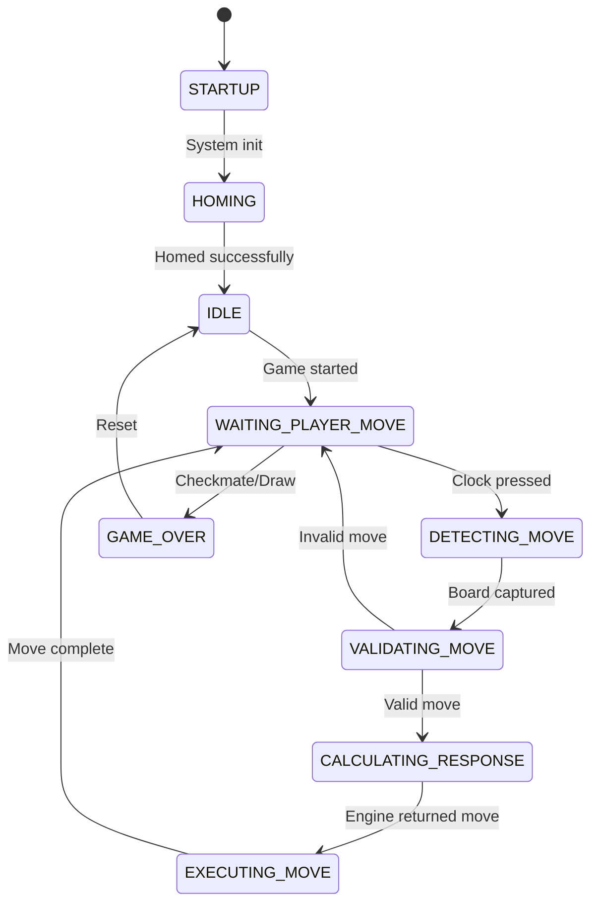

# Project Context - Smart Chess Board

> **Complete context document for AI agents. Read CLAUDE.md first.**

## Project Vision

Build an automated chess board that can:
1. Detect when a human player makes a move (via camera)
2. Calculate the optimal response (via chess engine)
3. Physically move the piece (via CoreXY gantry with electromagnet)
4. Capture pieces and move them to a graveyard area
5. Manage game timing with physical chess clocks

## System Architecture Overview

```
┌─────────────────────────────────────────────────────────────────┐
│                         RASPBERRY PI 4B                         │
├─────────────────────────────────────────────────────────────────┤
│  ┌─────────────┐  ┌─────────────┐  ┌─────────────┐              │
│  │   Camera    │  │  Stockfish  │  │    GPIO     │              │
│  │   Module    │  │   Engine    │  │  Interface  │              │
│  └──────┬──────┘  └──────┬──────┘  └──────┬──────┘              │
│         │                │                │                      │
│  ┌──────▼──────┐  ┌──────▼──────┐  ┌──────▼──────┐              │
│  │   chess_    │  │   chess_    │  │   chess_    │              │
│  │ perception  │  │   logic     │  │hw_interface │              │
│  └──────┬──────┘  └──────┬──────┘  └──────┬──────┘              │
│         │                │                │                      │
│         └────────────────┼────────────────┘                      │
│                          │                                       │
│                   ┌──────▼──────┐                                │
│                   │   gantry_   │                                │
│                   │   control   │                                │
│                   └─────────────┘                                │
└─────────────────────────────────────────────────────────────────┘
                           │
         ┌─────────────────┼─────────────────┐
         │                 │                 │
    ┌────▼────┐      ┌─────▼─────┐     ┌────▼────┐
    │ Stepper │      │   Servo   │     │ Limit   │
    │ Motors  │      │ + Magnet  │     │ Switches│
    └─────────┘      └───────────┘     └─────────┘
```

## Physical Layout

```
┌─────────────────────────────────────────────────┐
│                  GANTRY FRAME                    │
│  ┌───────────────────────────────────────────┐  │
│  │                                           │  │
│  │  [GRAVEYARD ZONE - behind black pieces]   │  │
│  │                                           │  │
│  │  ┌─────────────────────────────────────┐  │  │
│  │  │                                     │  │  │
│  │  │         8×8 CHESS BOARD             │  │  │
│  │  │    rank 8 (Black) ←────────         │  │  │
│  │  │        ┌───┐                        │  │  │
│  │  │        │MAG│ ← Permanent magnet     │  │  │
│  │  │        └───┘   on servo arm         │  │  │
│  │  │    rank 1 (White) ←────────         │  │  │
│  │  └─────────────────────────────────────┘  │  │
│  │                                           │  │
│  └───────────────────────────────────────────┘  │
│                                                  │
│  [Y-MIN limit]                     [X-MIN limit] │
│   (bottom of rail)                 (right side)  │
└─────────────────────────────────────────────────┘
     ↑ Camera mounted above (looking down)
     ↑ Chess clock nearby with clock-hit limit switch
```

### Coordinate System

- **Origin (0,0)**: Bottom-**right** corner after homing — this is where BOTH limit switches are triggered (X-MIN at far right, Y-MIN at bottom of rail)
- **+X direction**: LEFT (toward a-file / rank column a). The gantry moves LEFT when X increases.
- **+Y direction**: UP / BACKWARD (toward Black's side, rank 8). The gantry moves toward the back of the board when Y increases.
- **Z-axis**: Servo arm raises and lowers the **permanent magnet** below the board

> [!IMPORTANT]
> The X-MIN limit switch is at the FAR RIGHT (motor A side). This means after homing, the
> gantry is in the corner at (0,0) and must move POSITIVE X to reach square h1, then more
> positive X to reach a1. Square a1 is approximately **(200mm, 20mm)** from homed origin.

## Game Flow State Machine



## CoreXY Kinematics

The gantry uses CoreXY belting for X/Y motion:

```
Motor A steps = X_steps + Y_steps
Motor B steps = Y_steps - X_steps
```

Key parameters:
- **Steps per revolution**: 200 (NEMA 11 full-step)
- **Pulley pitch length per revolution**: 40mm (20T GT2 pulley)
- **Steps per mm**: ~5 steps/mm (full-step, no microstepping)

<!-- USER_ATTENTION: Verify these values with actual hardware calibration -->

## Board Mapping

Each chess square maps to physical X/Y coordinates:

<!-- USER_ATTENTION: These are estimated values - calibrate with actual board -->

| Square | X (mm) | Y (mm) | Notes |
|--------|--------|--------|-------|
| a1 | 200 | 20 | Closest to white's left; 200mm from origin |
| h1 | 25 | 20 | Near origin (right side); first rank |
| a8 | 200 | 195 | Far left, far back (Black's queen side) |
| h8 | 25 | 195 | Near X-origin, far back (Black's king side) |
| Square size | 25mm | 25mm | **Must verify with physical measurement** |

> [!NOTE]
> These values are based on user-measured estimates (a1 ≈ 200mm X, 20mm Y from origin).
> Run the hardware `gantry/square_navigation` test to verify each square.
> Formula: `square_x = 200 - (col_index * 25)`, `square_y = 20 + (rank_index * 25)`
> where col a=0, b=1...h=7 and rank 1=0, 2=1...8=7.

**Graveyard positions** (behind black's pieces, rank 8 side):
- All captured pieces (white and black): behind rank 8, Y ≈ 215mm
- Routing: piece moves horizontally to board edge first, then up to graveyard Y

## FEN Encoding

Board state is communicated using FEN (Forsyth-Edwards Notation):

```
Starting position:
rnbqkbnr/pppppppp/8/8/8/8/PPPPPPPP/RNBQKBNR w KQkq - 0 1
```

Piece encoding used internally:
| Code | Piece |
|------|-------|
| 0 | Empty |
| 1 | White Pawn |
| 2 | White Knight |
| 3 | White Bishop |
| 4 | White Rook |
| 5 | White Queen |
| 6 | White King |
| -1 | Black Pawn |
| -2 | Black Knight |
| ... | ... |

## Magnet System

The magnet system uses a **permanent magnet** (no electromagnet) attached to the end of the Z-axis servo arm. The servo raises and lowers the magnet through the underside of the chess board to attract and release chess pieces.

- **Servo engaged (down)**: Magnet is lowered to board surface — pieces are attracted
- **Servo released (up)**: Magnet is raised away from board — pieces are free
- **No GPIO power control needed** — the servo position alone controls pickup

### System Dependencies
```bash
sudo apt install python3-pip python3-opencv libcamera-apps
```

### Python Dependencies
```bash
pip3 install RPi.GPIO python-chess opencv-python numpy
```

### ROS 2 Dependencies
- `rclpy` - ROS 2 Python client library
- `std_msgs` - Standard message types
- `geometry_msgs` - Geometry message types
- `sensor_msgs` - Sensor message types (for images)

## File Locations Reference

| Purpose | Path |
|---------|------|
| GPIO pin config | `src/chess_hw_interface/config/pins.yaml` |
| CV parameters | `src/chess_perception/config/cv_params.yaml` |
| Board coordinates | `src/gantry_control/config/board_map.yaml` |
| Camera calibration | `src/chess_perception/config/calibration.npz` |
| Launch all | `src/launch/full_system_launch.py` |
| Test scripts | `code/*.py` |
| CAD exports | `cad/exports/` |
| System config (sudoers) | `setup/` |
| Vision system docs | `docs/features/vision-system.md` |

## Testing Hierarchy

1. **Unit Tests**: Individual function testing (pytest)
2. **Component Tests**: Hardware validation scripts in `code/`
3. **Integration Tests**: ROS 2 launch file testing
4. **System Tests**: Full game loop validation

## Common Failure Modes

| Symptom | Likely Cause | Solution |
|---------|--------------|----------|
| Motors don't move | Wrong pin config | Check `pins.yaml` BCM numbers |
| Motors jitter | Step timing too aggressive or noisy power | Increase `min_step_delay_ms`, verify motor PSU and common ground |
| Camera black | Not enabled | Run `sudo raspi-config`, enable camera |
| Permission denied | GPIO access | Add user to `gpio` group |
| Magnet weak | Insufficient power | Check 5V supply current capacity |

---

*See [CLAUDE.md](../CLAUDE.md) for quick reference and task guidelines.*
