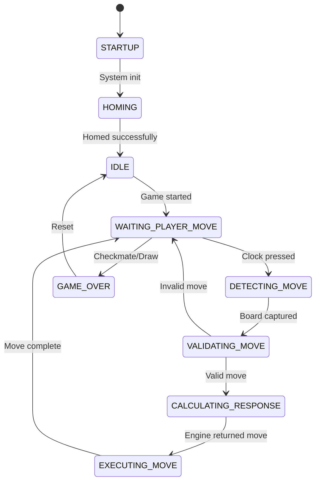

# Project Context - Smart Chess Board

> **Complete context document for AI agents. Read AGENTS.md first.**

## Project Vision

Build an automated chess board that can:
1. Detect when a human player makes a move (via camera)
2. Calculate the optimal response (via chess engine)
3. Physically move the piece (via CoreXY gantry with electromagnet)
4. Capture pieces and move them to a graveyard area
5. Manage game timing with physical chess clocks

## System Architecture Overview

```
┌─────────────────────────────────────────────────────────────────┐
│                         RASPBERRY PI 4B                         │
├─────────────────────────────────────────────────────────────────┤
│  ┌─────────────┐  ┌─────────────┐  ┌─────────────┐              │
│  │   Camera    │  │  Stockfish  │  │    GPIO     │              │
│  │   Module    │  │   Engine    │  │  Interface  │              │
│  └──────┬──────┘  └──────┬──────┘  └──────┬──────┘              │
│         │                │                │                      │
│  ┌──────▼──────┐  ┌──────▼──────┐  ┌──────▼──────┐              │
│  │   chess_    │  │   chess_    │  │   chess_    │              │
│  │ perception  │  │   logic     │  │hw_interface │              │
│  └──────┬──────┘  └──────┬──────┘  └──────┬──────┘              │
│         │                │                │                      │
│         └────────────────┼────────────────┘                      │
│                          │                                       │
│                   ┌──────▼──────┐                                │
│                   │   gantry_   │                                │
│                   │   control   │                                │
│                   └─────────────┘                                │
└─────────────────────────────────────────────────────────────────┘
                           │
         ┌─────────────────┼─────────────────┐
         │                 │                 │
    ┌────▼────┐      ┌─────▼─────┐     ┌────▼────┐
    │ Stepper │      │   Servo   │     │ Limit   │
    │ Motors  │      │ + Magnet  │     │ Switches│
    └─────────┘      └───────────┘     └─────────┘
```

## Physical Layout

<!-- USER_ATTENTION: Update these dimensions with actual measurements -->

```
┌─────────────────────────────────────────────────┐
│                 GANTRY FRAME                     │
│  ┌───────────────────────────────────────────┐  │
│  │             Y-axis travel                 │  │
│  │  ┌─────────────────────────────────────┐  │  │
│  │  │                                     │  │  │
│  │  │         8×8 CHESS BOARD             │  │  │
│  │  │                                     │  │ X│
│  │  │      ┌───┐                          │  │ -│
│  │  │      │MAG│ ← Electromagnet head     │  │ a│
│  │  │      └───┘                          │  │ x│
│  │  │                                     │  │ i│
│  │  └─────────────────────────────────────┘  │ s│
│  │                                           │  │
│  │  [GRAVEYARD WHITE]    [GRAVEYARD BLACK]   │  │
│  │                                           │  │
│  └───────────────────────────────────────────┘  │
│                                                  │
│  [X-MIN]                           [Y-MIN]      │
│   limit                             limit       │
└─────────────────────────────────────────────────┘
     ↑ Camera mounted above (looking down)
```

### Coordinate System

- **Origin (0,0)**: Bottom-left corner after homing (X-MIN, Y-MIN)
- **X-axis**: Left to right (files a-h)
- **Y-axis**: Bottom to top (ranks 1-8)
- **Z-axis**: Servo up/down for magnet engage/release

## Game Flow State Machine



## CoreXY Kinematics

The gantry uses CoreXY belting for X/Y motion:

```
Motor A steps = X_steps + Y_steps
Motor B steps = Y_steps - X_steps
```

Key parameters:
- **Steps per revolution**: 200 (NEMA 11 full-step)
- **Pulley pitch length per revolution**: 40mm (20T GT2 pulley)
- **Steps per mm**: ~5 steps/mm (full-step, no microstepping)

<!-- USER_ATTENTION: Verify these values with actual hardware calibration -->

## Board Mapping

Each chess square maps to physical X/Y coordinates:

<!-- USER_ATTENTION: These are estimated values - calibrate with actual board -->

| Square | X (mm) | Y (mm) | Notes |
|--------|--------|--------|-------|
| a1 | 25 | 25 | Origin corner |
| h1 | 200 | 25 | |
| a8 | 25 | 200 | |
| h8 | 200 | 200 | Far corner |
| Square size | 25mm | 25mm | Assumed |

**Graveyard positions**:
- White captured: X=230-280, Y=25-100
- Black captured: X=230-280, Y=125-200

## FEN Encoding

Board state is communicated using FEN (Forsyth-Edwards Notation):

```
Starting position:
rnbqkbnr/pppppppp/8/8/8/8/PPPPPPPP/RNBQKBNR w KQkq - 0 1
```

Piece encoding used internally:
| Code | Piece |
|------|-------|
| 0 | Empty |
| 1 | White Pawn |
| 2 | White Knight |
| 3 | White Bishop |
| 4 | White Rook |
| 5 | White Queen |
| 6 | White King |
| -1 | Black Pawn |
| -2 | Black Knight |
| ... | ... |

## Dependencies

### System Dependencies
```bash
sudo apt install python3-pip python3-opencv libcamera-apps
```

### Python Dependencies
```bash
pip3 install RPi.GPIO python-chess opencv-python numpy
```

### ROS 2 Dependencies
- `rclpy` - ROS 2 Python client library
- `std_msgs` - Standard message types
- `geometry_msgs` - Geometry message types
- `sensor_msgs` - Sensor message types (for images)

## File Locations Reference

| Purpose | Path |
|---------|------|
| GPIO pin config | `src/chess_hw_interface/config/pins.yaml` |
| CV parameters | `src/chess_perception/config/cv_params.yaml` |
| Board coordinates | `src/gantry_control/config/board_map.yaml` |
| Launch all | `src/launch/full_system_launch.py` |
| Test scripts | `code/*.py` |
| CAD exports | `cad/exports/` |

## Testing Hierarchy

1. **Unit Tests**: Individual function testing (pytest)
2. **Component Tests**: Hardware validation scripts in `code/`
3. **Integration Tests**: ROS 2 launch file testing
4. **System Tests**: Full game loop validation

## Common Failure Modes

| Symptom | Likely Cause | Solution |
|---------|--------------|----------|
| Motors don't move | Wrong pin config | Check `pins.yaml` BCM numbers |
| Motors jitter | Step timing too aggressive or noisy power | Increase `min_step_delay_ms`, verify motor PSU and common ground |
| Camera black | Not enabled | Run `sudo raspi-config`, enable camera |
| Permission denied | GPIO access | Add user to `gpio` group |
| Magnet weak | Insufficient power | Check 5V supply current capacity |

---

*See [AGENTS.md](../AGENTS.md) for quick reference and task guidelines.*
