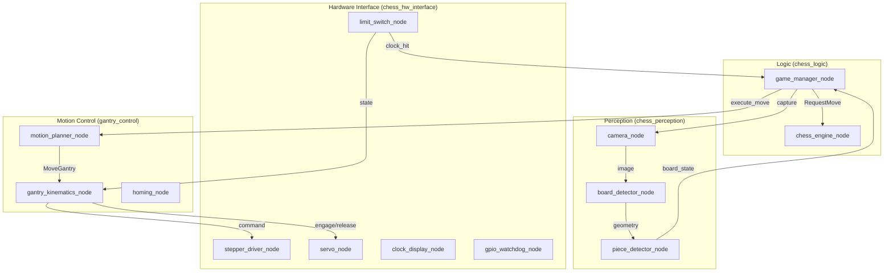

# System Architecture

> **High-level system design and data flow.**

## Architecture Diagram



## Data Flow

### Game Loop Sequence

```
1. Player presses clock (limit_switch_node detects)
         │
         ▼
2. game_manager_node receives clock_hit event
         │
         ▼
3. camera_node captures board image
         │
         ▼
4. board_detector_node finds grid corners
         │
         ▼
5. piece_detector_node identifies pieces → FEN
         │
         ▼
6. game_manager_node compares FEN to previous state
         │
         ├── Invalid move → Signal error, wait for correction
         │
         ▼
7. chess_engine_node calculates best response (Stockfish)
         │
         ▼
8. motion_planner_node creates pick-and-place sequence
         │
         ▼
9. gantry_kinematics_node executes CoreXY motion
         │
         ▼
10. servo_node engages/releases magnet
         │
         ▼
11. Wait for player's next move (return to step 1)
```

## State Machine (game_manager_node)

```
                    ┌───────────────────────────────────────────────┐
                    │                  STARTUP                       │
                    │          (Initialize all nodes)                │
                    └───────────────────────┬───────────────────────┘
                                            │
                                            ▼
                    ┌───────────────────────────────────────────────┐
                    │                   HOMING                       │
                    │        (Move to limit switches, zero)          │
                    └───────────────────────┬───────────────────────┘
                                            │ homing complete
                                            ▼
    ┌──────────────────────────────────────────────────────────────────────────┐
    │                                  IDLE                                     │
    │                        (Waiting for game start)                           │
    └──────────────────────────────────┬───────────────────────────────────────┘
                                       │ start game
                                       ▼
    ┌──────────────────────────────────────────────────────────────────────────┐
    │                        WAITING_PLAYER_MOVE                                │◄───────┐
    │                   (Human's turn - monitoring clock)                       │        │
    └──────────────────────────────────┬───────────────────────────────────────┘        │
                                       │ clock pressed                                   │
                                       ▼                                                 │
    ┌──────────────────────────────────────────────────────────────────────────┐        │
    │                          DETECTING_MOVE                                   │        │
    │                   (Capture and analyze board image)                       │        │
    └──────────────────────────────────┬───────────────────────────────────────┘        │
                                       │                                                 │
                                       ▼                                                 │
    ┌──────────────────────────────────────────────────────────────────────────┐        │
    │                         VALIDATING_MOVE                                   │        │
    │                 (Compare FEN, check legal move)                           │        │
    └───────────────┬──────────────────┴──────────────────┬────────────────────┘        │
                    │ invalid                              │ valid                        │
                    │                                      ▼                              │
                    │      ┌───────────────────────────────────────────────────┐         │
                    │      │               CALCULATING_RESPONSE                 │         │
                    │      │              (Query Stockfish engine)              │         │
                    │      └───────────────────────┬───────────────────────────┘         │
                    │                              │                                      │
                    │                              ▼                                      │
                    │      ┌───────────────────────────────────────────────────┐         │
                    │      │                EXECUTING_MOVE                      │         │
                    │      │         (Gantry moves piece physically)            │         │
                    │      └───────────────────────┬───────────────────────────┘         │
                    │                              │ move complete                        │
                    └──────────────────────────────┴─────────────────────────────────────┘
                               │
                               ▼
    ┌──────────────────────────────────────────────────────────────────────────┐
    │                            GAME_OVER                                      │
    │               (Checkmate, draw, or resignation)                           │
    └──────────────────────────────────────────────────────────────────────────┘
```

## Package Dependencies

```
chess_hw_interface (no internal deps)
        │
        ├──────────────────────┐
        │                      │
        ▼                      ▼
chess_perception        gantry_control
        │                      │
        └──────┬───────────────┘
               │
               ▼
         chess_logic
```

## Communication Patterns

### Topics (Pub/Sub)
- Continuous data streams (sensor data, status)
- One-to-many communication

| Topic | Message Type | Publisher | Subscribers |
|-------|--------------|-----------|-------------|
| `/stepper/command` | geometry_msgs/Point | gantry_kinematics | stepper_driver |
| `/stepper/status` | std_msgs/String | stepper_driver | gantry_kinematics |
| `/limit_switch/state` | LimitSwitchState | limit_switch | gantry_kinematics, game_manager |
| `/camera/image_raw` | sensor_msgs/Image | camera | board_detector |
| `/perception/board_state` | BoardState | piece_detector | game_manager |
| `/gantry/pose` | geometry_msgs/Point | gantry_kinematics | motion_planner |

### Services (Request/Reply)
- Synchronous operations
- One-to-one communication

| Service | Type | Server | Clients |
|---------|------|--------|---------|
| `/camera/capture` | Trigger | camera | game_manager |
| `/servo/engage` | Trigger | servo | motion_planner |
| `/servo/release` | Trigger | servo | motion_planner |
| `/chess_engine/request_move` | RequestMove | chess_engine | game_manager |

### Actions (Long-running)
- Asynchronous operations with feedback
- Cancelable

| Action | Type | Server | Clients |
|--------|------|--------|---------|
| `/gantry/move` | MoveGantry | gantry_kinematics | motion_planner |

## Launch Architecture

```
full_system_launch.py
    ├── hw_interface_launch.py
    │       ├── stepper_driver_node
    │       ├── servo_node
    │       ├── limit_switch_node
    │       ├── clock_display_node
    │       └── gpio_watchdog_node
    │
    ├── perception_launch.py
    │       ├── camera_node
    │       ├── board_detector_node
    │       └── piece_detector_node
    │
    ├── gantry_launch.py
    │       ├── gantry_kinematics_node
    │       ├── motion_planner_node
    │       └── homing_node
    │
    └── logic_launch.py
            ├── game_manager_node
            └── chess_engine_node
```

---

*See [nodes.md](nodes.md) for detailed node specifications.*
